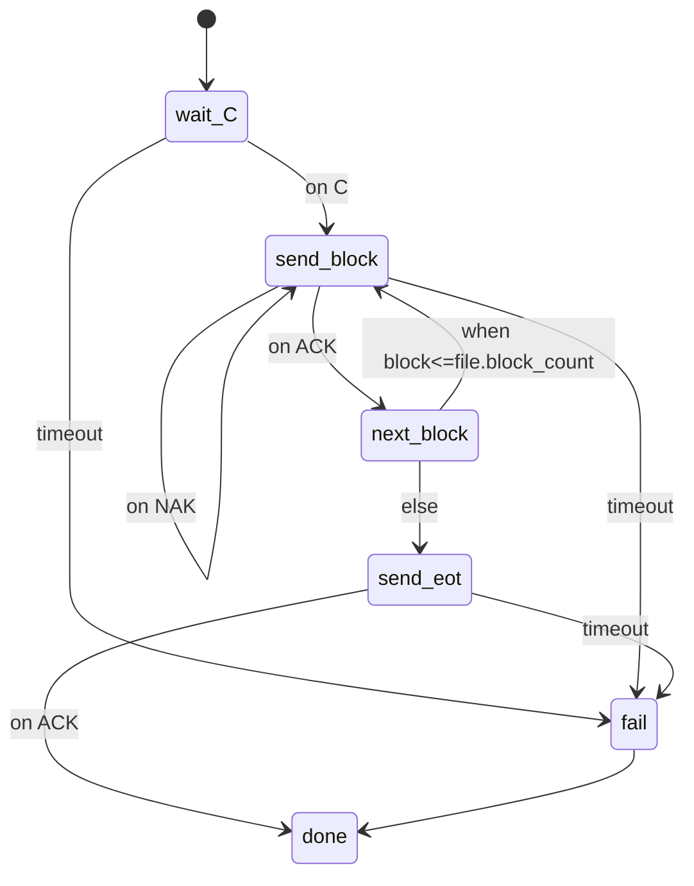

# ToolOfCom 用户使用说明书

## 1. ToolOfCom 概述
ToolOfCom 是面向嵌入式/工控/自动化测试的通信自动化运行时，采用 **YAML DSL + 状态机** 的声明式方式，将通信流程与协议动作解耦，帮助快速编排串口/TCP 交互、固件传输、Modbus 读写等任务。  
架构链路：`YAML DSL → 状态机 → 动作 (Actions) → 协议适配 → 通道 (UART/TCP)`。

核心理念：流程（DSL）定义“做什么 & 顺序”，动作/协议适配层定义“怎么发/怎么收”，通道提供底层 IO。

## 2. 安装与运行
- 依赖：`pip install pyyaml`，使用串口需 `pip install pyserial`。
- 入口：`python dsl_main.py <your_script.yaml>`
- 输入：符合 DSL 规范的 YAML 脚本。
- 输出：日志（INFO/DEBUG），状态机执行的事件流；动作可产生下行数据，通道可回传事件。

## 3. YAML DSL 总览
DSL 采用声明式状态机：
```yaml
version: 1
vars: {...}          # 初始变量
channels: {...}      # 通道定义 (uart/tcp)
state_machine:
  initial: <state>
  states:
    <state_name>:
      do: [...]      # 动作列表
      on_event: {...}
      timeout: <ms>
      on_timeout: <state>
      when: <expr>
      goto: <state>
      else_goto: <state>
```

## 4. 通道（Channels）系统
支持 UART 与 TCP。
- UART 字段：`type: uart|serial`，`device: COMx 或 /dev/tty...`，`baudrate`（默认 115200）
- TCP 字段：`type: tcp`，`host`，`port`，`timeout`(秒，可选)

示例：
```yaml
channels:
  boot:
    type: uart
    device: COM5
    baudrate: 115200
  plc:
    type: tcp
    host: 192.168.1.10
    port: 502
```

## 5. 变量系统（vars）
- 定义：`vars:` 顶层对象，键值可为数字/字符串。
- 作用域：全局，执行期可被 set 动作修改。
- 访问：表达式中以 `$var` 或 `$obj.field` 引用。
- 修改：`- set: { var_name: "<expr or literal>" }`。

## 6. 表达式系统（Expressions）
- 运算符：`+ - * / % **`，比较 `== != > >= < <=`，逻辑 `and/or/not`（也支持 `&& || !` 写法）。
- 类型：数字、字符串、布尔、对象（属性/下标访问）。
- 内置变量：`$now` 当前时间戳 ms，`$event` 最近事件，用户变量 `$block`、`$file.block_count` 等。

示例：
```yaml
when: "$block <= file.block_count"
set: { retry: "$retry + 1" }
log: "progress=$block/$file.block_count at $now"
```

## 7. 状态机 DSL（核心）
元素：
- `do`: 动作列表，按序执行。
- `on_event`: 事件跳转映射。
- `timeout` + `on_timeout`: 超时处理（ms）。
- `when` + `goto` + `else_goto`: 条件跳转；若无 when 则直接 goto。
- 状态结束到 `done` 视为流程完成。

执行流程：进入状态 → 执行 do → 条件/直接 goto → 等事件或等待超时 → 跳转 → 结束。

Mermaid 流程示例（XMODEM 核心流程）：


## 8. 动作（Actions）系统
- 调用：`- action: <name>`，可带 `args: { ... }`。
- 内置动作：
  - `set`: 更新变量。
  - `log`: 输出日志。
  - `wait`: 毫秒休眠。
  - `wait_for_event`: 阻塞等待事件（可指定 `event`、`timeout`）。
- 协议动作：XMODEM/Modbus 等（下文详述）。
- 自定义动作：在 Python 中 `ActionRegistry.register("name", fn)` 注册，`fn(ctx, args)` 使用 `ctx.channel_write` / `ctx.set_var` / `ctx.vars_snapshot`。

### 8.1 Schema 帧动作（自定义帧 + 动作注册）
1) 定义协议帧 schema（示例）：
   ```yaml
   frames:
     req_read:
       header: AA55
       tail: 0D0A
       crc: crc16_modbus
       fields:
         - { name: addr, type: u16, endian: little }
         - { name: length, type: u16, endian: little }
     rsp_read:
       header: AA55
       tail: 0D0A
       crc: crc16_modbus
       fields:
         - { name: status, type: u8 }
         - { name: data, type: bytes, length: 16 }
   ```
2) 在 DSL 中发送/接收自定义帧（动作已在运行器/UI 启动时注册）：
   ```yaml
   - action: send_frame
     args:
       schema: ./proto_schema.yaml
       frame: req_read
       values: { addr: 0x1234, length: 16 }
   - action: expect_frame
     args:
       schema: ./proto_schema.yaml
       frame: rsp_read
       timeout: 2
       save_as: rsp
   ```
   - `send_frame`：按 schema 组帧并写入通道，`last_frame_tx` 保存 hex 和字段值。
   - `expect_frame`：按尾部或固定长度读取并解析，结果存 `save_as`（默认 `last_frame_rx`），原始 hex 存 `last_frame_rx_raw`。
3) 注册更多自定义动作（同样在启动时生效）：
   ```python
   from actions.registry import ActionRegistry

   def my_action(ctx, args):
       # 例如写入自定义数据或组合多步逻辑
       ctx.channel_write(b"hello")

   ActionRegistry.register("my_action", my_action)
   ```
   之后 DSL 可直接 `- action: my_action` 调用。

### 8.2 曲线窗口（PyQtGraph，多曲线/多窗口）
- 配置：顶层 `ui.charts`，`bind` 为数据 key，`group` 同窗显示，`separate: true` 独立窗口。
  ```yaml
  ui:
    charts:
      - id: temp
        title: "Temperature"
        bind: temp
        group: main
      - id: current
        title: "Current"
        bind: current
        group: main
      - id: voltage
        title: "Voltage"
        bind: voltage
        separate: true
  ```
- 推送数据：`chart_add` 动作（需在 Qt GUI 运行器）。
  ```yaml
  - action: chart_add
    args: { bind: temp, value: "$temp_val", ts: "$now/1000" }  # ts 秒，省略则用当前时间
  ```
- 行为：按 `group/separate` 自动建一个或多个窗口；UI 线程每 30ms 刷新，双缓冲平滑绘制。

## 9. XMODEM 动作
- `send_xmodem_block`：发送指定块号（128B，自动 0x1A 填充），参数 `block: "$block"`。
- `send_eot`：发送 EOT 结束。
常见编排：等待 “C” → 发送块 → 等 ACK/NAK → 自增 block → 重复 → 发送 EOT。

## 10. YMODEM 动作
当前示例主要提供 XMODEM；YMODEM 可类比扩展：发送 header、数据块、EOT（可参考 XMODEM 动作并新增 `send_ymodem_header` / `send_ymodem_block` / `send_ymodem_eot` 动作）。

## 11. Modbus（RTU/ASCII/TCP）动作
- 预留动作：`modbus_read` / `modbus_write`
  - 参数：`protocol: rtu|ascii|tcp`，`function`，`address`，`quantity`，`values`（写），`unit_id`。
- 差异：RTU（CRC16，二进制）；ASCII（LRC，文本帧）；TCP（MBAP，无 CRC）。
可在动作注册中添加并编排到状态机。

## 12. 事件系统（Events）
- 来源：通道 `read_event`（UART/TCP 读取到的字节，默认字符；无法解码则 HEX 字符串）。
- 常见：XMODEM 场景 `"C"`、`"ACK"`、`"NAK"`（需设备回送对应字节）。
- on_event：`on_event: { "C": send_block, ACK: next_block }`。

## 13. 完整示例
### 13.1 XMODEM 升级
```yaml
version: 1
vars:
  block: 1
  file_path: ./firmware.bin
channels:
  boot:
    type: uart
    device: COM5
    baudrate: 115200
state_machine:
  initial: wait_C
  states:
    wait_C:
      on_event:
        "C": send_block
      timeout: 5000
      on_timeout: fail
    send_block:
      do:
        - action: send_xmodem_block
          args: { block: "$block" }
      on_event:
        ACK: next_block
        NAK: send_block
      timeout: 2000
      on_timeout: fail
    next_block:
      do:
        - set: { block: "$block + 1" }
      when: "$block <= file.block_count"
      goto: send_block
      else_goto: send_eot
    send_eot:
      do:
        - action: send_eot
      on_event:
        ACK: done
      timeout: 2000
      on_timeout: fail
    fail:
      do: [ { log: "Failed" } ]
      goto: done
    done:
      do: [ { log: "Completed" } ]
```

### 13.2 YMODEM 示例（需自扩展动作）
```yaml
# 假设已注册 send_ymodem_header/send_ymodem_block/send_ymodem_eot
vars: { block: 1, file_path: ./file.bin }
state_machine:
  initial: start
  states:
    start:
      do: [ { action: send_ymodem_header } ]
      on_event: { ACK: send_block }
    send_block:
      do: [ { action: send_ymodem_block, args: { block: "$block" } } ]
      on_event: { ACK: inc_or_end, NAK: send_block }
    inc_or_end:
      do: [ { set: { block: "$block + 1" } } ]
      when: "$block <= file.block_count"
      goto: send_block
      else_goto: send_eot
    send_eot:
      do: [ { action: send_ymodem_eot } ]
      on_event: { ACK: done }
    done: { do: [ { log: "OK" } ] }
```

### 13.3 Modbus 轮询读写
```yaml
vars:
  retries: 0
channels:
  plc:
    type: tcp
    host: 192.168.1.10
    port: 502
state_machine:
  initial: read_regs
  states:
    read_regs:
      do:
        - action: modbus_read
          args:
            protocol: tcp
            function: 3
            address: 4096
            quantity: 2
            unit_id: 1
      goto: write_regs
    write_regs:
      do:
        - action: modbus_write
          args:
            protocol: tcp
            function: 16
            address: 4098
            values: [1, 2]
            unit_id: 1
      goto: done
    done:
      do: [ { log: "Modbus flow done" } ]
```

### 13.4 组合示例（升级后写寄存器）
```yaml
vars: { block: 1, file_path: ./fw.bin }
channels:
  boot: { type: uart, device: COM5, baudrate: 115200 }
  plc:  { type: tcp, host: 192.168.1.10, port: 502 }
state_machine:
  initial: wait_C
  states:
    # 略，沿用 XMODEM 流程
    done:
      do:
        - action: modbus_write
          args: { protocol: tcp, function: 6, address: 4100, values: [1], unit_id: 1 }
        - log: "Upgrade + Modbus write finished"
```

## 14. 错误处理与调试
- 日志：INFO 记录状态进入/动作执行，DEBUG 记录事件。
- 常见问题：
  - YAML 结构错误：检查 `state_machine.initial` 是否存在于 `states`。
  - 表达式未定义变量：确保 `$var` 已在 vars 或 set 后存在。
  - 事件未匹配：确认设备回送字符与 on_event 匹配（大小写）。
- 调试技巧：
  - 提高日志等级为 DEBUG。
  - 在关键状态添加 `log` 输出变量/上下文。
  - 合理设置 `timeout`，避免过短导致误判。

## 15. 扩展指南
- 添加新动作：
  ```python
  from actions.registry import ActionRegistry
  def my_action(ctx, args):
      # ctx.channel_write / ctx.set_var / ctx.vars_snapshot()
      ...
  ActionRegistry.register("my_action", my_action)
  ```
- 添加新协议动作：在 `actions/*.py` 中封装协议逻辑，调用协议封包构造器（如 XMODEM/Modbus）。
- 添加新协议适配：实现协议封包/解析，供动作调用。
- 扩展 DSL：修改 `dsl/parser.py` / `dsl/ast_nodes.py` / `dsl/executor.py` 增加新语法字段，保持向后兼容。
- 让 AI 编写 DSL：提供章节 7/8 模板，明确事件名、超时、变量命名，AI 可按样例生成 YAML。

## 16. 附录
- 关键字：`version`, `vars`, `channels`, `state_machine`, `initial`, `states`, `do`, `on_event`, `timeout`, `on_timeout`, `when`, `goto`, `else_goto`
- 内置变量：`$now`，`$event`，用户变量（vars + set 生成）；示例中 `file`、`file.block_count` 可由文件元信息动作填充。
- 内置动作：`set`，`log`，`wait`，`wait_for_event`；仪表动作：`meter_start`，`meter_add`，`meter_stop`；曲线动作：`chart_add`；协议动作：`send_xmodem_block`，`send_eot`；（可扩展：`modbus_read`，`modbus_write` 等）
- 表达式：算术/比较/逻辑，变量 `$var`/`$a.b`，内置 `$now/$event`。
- 通道参数：UART `device`、`baudrate`；TCP `host`、`port`、`timeout`。
- 简化 BNF（核心）：
```
script    ::= "version"? "vars"? "channels" "state_machine"
state_machine ::= "initial" state_name "states" state_block+
state_block ::= state_name ":" state_body
state_body ::= ("do": action_list)? ("on_event": event_map)?
               ("timeout": int)? ("on_timeout": state_name)?
               ("when": expr)? ("goto": state_name)?
               ("else_goto": state_name)?
action_list ::= "-" action_entry+
action_entry ::= {"action": name, "args": obj} |
                 {"set": obj} | {"log": str} |
                 {"wait": int|obj} | {"wait_for_event": obj}
expr      ::= 参见表达式系统，支持 $var 引用
```

---

本说明书面向嵌入式开发/工控通讯/自动化测试工程师及可编程 Agent，覆盖 DSL、状态机、动作系统、协议适配与扩展方法，可直接作为开源文档发布。***
