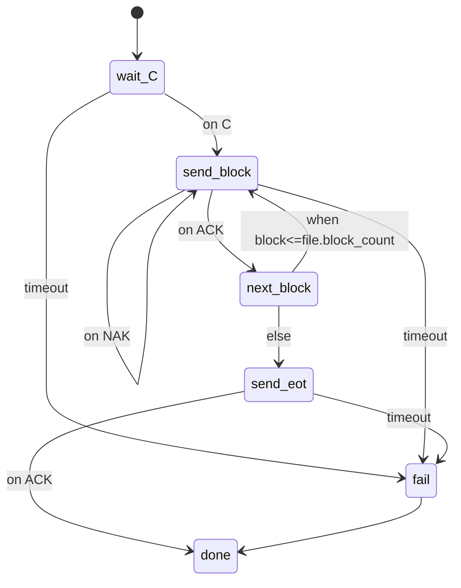

# ProtoFlow User Guide

## 1. Overview
ProtoFlow is a communication automation runtime for embedded/industrial/automation testing. It uses a **YAML DSL + state machine** to define flows declaratively, decoupling communication steps from protocol actions so you can script UART/TCP exchanges, firmware transfers, Modbus operations, and custom protocols quickly.  
Pipeline: `YAML DSL → state machine → actions → protocol adapter → channel (UART/TCP)`.

## 2. Installation & Run
- Dependencies: `pip install pyyaml`; for serial use `pip install pyserial`.
- Entry point: `python dsl_main.py <your_script.yaml>`
- Input: YAML script that follows the DSL spec.
- Output: logs (INFO/DEBUG), state-machine event trace; actions can emit outbound data, channels can raise events.

## 3. YAML DSL at a Glance
Declarative state machine:
```yaml
version: 1
vars: {...}          # initial variables
channels: {...}      # channel definitions (uart/tcp)
state_machine:
  initial: <state>
  states:
    <state_name>:
      do: [...]      # actions
      on_event: {...}
      timeout: <ms>
      on_timeout: <state>
      when: <expr>
      goto: <state>
      else_goto: <state>
```

## 4. Channels (UART/TCP)
- UART fields: `type: uart|serial`, `device: COMx or /dev/tty...`, `baudrate` (default 115200)
- TCP fields: `type: tcp`, `host`, `port`, `timeout` (seconds, optional)
Example:
```yaml
channels:
  boot:
    type: uart
    device: COM5
    baudrate: 115200
  plc:
    type: tcp
    host: 192.168.1.10
    port: 502
```

## 5. Variable System (`vars`)
- Define: top-level `vars:` object; values can be numbers or strings.
- Scope: global; can be updated by `set` actions.
- Access: expressions use `$var` or `$obj.field`.
- Update: `- set: { var_name: "<expr or literal>" }`

## 6. Expression System
- Operators: `+ - * / % **`, comparisons `== != > >= < <=`, logic `and/or/not` (also `&& || !`).
- Types: number, string, boolean, object (field/index access).
- Built-ins: `$now` (ms), `$event` (last event), user vars (`$block`, `$file.block_count`, etc.).
Example:
```yaml
when: "$block <= file.block_count"
set: { retry: "$retry + 1" }
log: "progress=$block/$file.block_count at $now"
```

## 7. State Machine (core)
Elements:
- `do`: action list executed sequentially.
- `on_event`: event→state mapping.
- `timeout` + `on_timeout`: timeout handling (ms).
- `when` + `goto` + `else_goto`: conditional transition; without `when` it jumps directly.
- Terminal: reaching state `done` is considered completion.
Execution: enter state → run `do` → conditional/direct goto → wait for event or timeout → transition → finish.
Mermaid example (XMODEM core):


## 8. Actions System
- Call: `- action: <name>` with optional `args: { ... }`.
- Built-ins:
  - `set`: update variable.
  - `log`: print log.
  - `wait`: sleep in ms.
  - `wait_for_event`: blocking wait (supports `event`, `timeout`).
  - `if`: conditional inline action block (`when`, `then`, `else`).
  - `list_filter`: filter a list into a new list (`src`, `where`, optional `dst`).
  - `list_map`: map a list into a new list (`src`, `expr`, optional `dst`, optional `where`).
- Protocol actions: XMODEM/Modbus etc. (see below).
- Custom actions: in Python `ActionRegistry.register("name", fn)`, where `fn(ctx, args)` can use `ctx.channel_write` / `ctx.set_var` / `ctx.vars_snapshot`.

### 8.2 Data Processing (filter/transform)
`if` (recommended to reduce extra states when you only need to filter/branch inside `do`):
```yaml
do:
  - if:
      when: "$event_name == 'ui.param.apply' and $event_payload.enabled"
      then:
        - set: { threshold: "$event_payload.threshold" }
        - log: "threshold applied: $threshold"
      else:
        - log: "ignored"
```

`list_filter` / `list_map` evaluate expressions per item. You can use `$item`, `$index`, and for dict items also `$item.<key>` (identifier keys only).
```yaml
do:
  - set: { samples: [1, 2, 3, 4, 5] }
  - action: list_filter
    args: { src: "$samples", where: "$item % 2 == 1", dst: odd }
  - action: list_map
    args: { src: "$odd", expr: "$item * 10", dst: scaled }
  - log: "scaled=$scaled"
```

### 8.1 Schema Frame Actions (custom frames + registered actions)
1) Define protocol frame schema (example):
   ```yaml
   frames:
     req_read:
       header: AA55
       tail: 0D0A
       crc: crc16_modbus
       fields:
         - { name: addr, type: u16, endian: little }
         - { name: length, type: u16, endian: little }
     rsp_read:
       header: AA55
       tail: 0D0A
       crc: crc16_modbus
       fields:
         - { name: status, type: u8 }
         - { name: data, type: bytes, length: 16 }
   ```
2) Use in DSL (actions are auto-registered at runner/UI startup):
   ```yaml
   - action: send_frame
     args:
       schema: ./proto_schema.yaml
       frame: req_read
       values: { addr: 0x1234, length: 16 }
   - action: expect_frame
     args:
       schema: ./proto_schema.yaml
       frame: rsp_read
       timeout: 2
       save_as: rsp
   ```
   - `send_frame`: builds packet per schema, writes to channel, stores `last_frame_tx` (hex + values).
   - `expect_frame`: reads by tail or fixed length, parses, stores result in `save_as` (default `last_frame_rx`), raw hex in `last_frame_rx_raw`.
3) Register more custom actions (also applied at startup):
   ```python
   from actions.registry import ActionRegistry

   def my_action(ctx, args):
       # e.g., write custom bytes or combine multiple steps
       ctx.channel_write(b"hello")

   ActionRegistry.register("my_action", my_action)
   ```
   Then call in DSL: `- action: my_action`.

### 8.3 Charts (PyQtGraph multi-curve/multi-window)
- Config: top-level `ui.charts`, `bind` is data key, `group` shares a window, `separate: true` opens its own window.
  ```yaml
  ui:
    charts:
      - id: temp
        title: "Temperature"
        bind: temp
        group: main
      - id: current
        title: "Current"
        bind: current
        group: main
      - id: voltage
        title: "Voltage"
        bind: voltage
        separate: true
  ```
- Push data: `chart_add` action (Qt GUI runner required).
  ```yaml
  - action: chart_add
    args: { bind: temp, value: "$temp_val", ts: "$now/1000" }  # ts seconds; defaults to now if omitted
  ```
- Behavior: builds one or more windows per `group/separate`; UI thread refreshes every 30ms with double buffering.

## 8.3 Non-blocking Controls (ui.controls)
- `ui.controls` defines separate, non-modal input panels. Buttons emit EventBus events via `emit`; FSM consumes via existing `on_event` / `wait_for_event` (no blocking).

## 8.4 Declarative Layout (ui.layout, stage 1)
- Optional YAML structure that places existing charts/controls into a single window using `split` (horizontal/vertical) and leaf references (`charts`/`controls`); no docking/drag-drop/geometry.

## 8.5 3D Chart (scatter3d)
- `ui.charts` supports `type: scatter3d` with `bind_x`/`bind_y`/`bind_z`, and `chart_add3d` to push points.
- Requires `pyqtgraph.opengl` (typically `PyOpenGL`).

## 9. XMODEM Actions
- `send_xmodem_block`: send specified block (128B, padded with 0x1A), arg `block: "$block"`.
- `send_eot`: send EOT to finish.
Typical flow: wait for "C" → send block → wait ACK/NAK → increment block → repeat → send EOT.

## 10. YMODEM Actions
Currently examples are XMODEM-focused; YMODEM can be added similarly with actions like `send_ymodem_header` / `send_ymodem_block` / `send_ymodem_eot`.

## 11. Modbus (RTU/ASCII/TCP) Actions
- Reserved actions: `modbus_read` / `modbus_write` (not implemented in current DSL runner; docs placeholder)
  - Args: `protocol: rtu|ascii|tcp`, `function`, `address`, `quantity`, `values` (for write), `unit_id`.
- Differences: RTU (CRC16, binary); ASCII (LRC, text frame); TCP (MBAP, no CRC).
- Note: Modbus protocol drivers exist under `protocols/modbus_*.py` and are callable from `main_runtime.py` tasks mode; adding DSL actions requires registering them.

## 12. Event System
- Sources: channel `read_event` (UART/TCP bytes; default decoded to text, fallback HEX string).
- Common: XMODEM events `"C"`, `"ACK"`, `"NAK"` (device must emit matching bytes).
- `on_event`: e.g. `on_event: { "C": send_block, ACK: next_block }`.

## 13. Full Examples
### 13.1 XMODEM Upgrade
```yaml
version: 1
vars:
  block: 1
  file_path: ./firmware.bin
channels:
  boot:
    type: uart
    device: COM5
    baudrate: 115200
state_machine:
  initial: wait_C
  states:
    wait_C:
      on_event:
        "C": send_block
      timeout: 5000
      on_timeout: fail
    send_block:
      do:
        - action: send_xmodem_block
          args: { block: "$block" }
      on_event:
        ACK: next_block
        NAK: send_block
      timeout: 2000
      on_timeout: fail
    next_block:
      do:
        - set: { block: "$block + 1" }
      when: "$block <= file.block_count"
      goto: send_block
      else_goto: send_eot
    send_eot:
      do:
        - action: send_eot
      on_event:
        ACK: done
      timeout: 2000
      on_timeout: fail
    fail:
      do: [ { log: "Failed" } ]
      goto: done
    done:
      do: [ { log: "Completed" } ]
```

### 13.2 YMODEM (requires custom actions)
```yaml
# assume send_ymodem_header/send_ymodem_block/send_ymodem_eot are registered
vars: { block: 1, file_path: ./file.bin }
state_machine:
  initial: start
  states:
    start:
      do: [ { action: send_ymodem_header } ]
      on_event: { ACK: send_block }
    send_block:
      do: [ { action: send_ymodem_block, args: { block: "$block" } } ]
      on_event: { ACK: inc_or_end, NAK: send_block }
    inc_or_end:
      do: [ { set: { block: "$block + 1" } } ]
      when: "$block <= file.block_count"
      goto: send_block
      else_goto: send_eot
    send_eot:
      do: [ { action: send_ymodem_eot } ]
      on_event: { ACK: done }
    done: { do: [ { log: "OK" } ] }
```

### 13.3 Modbus Poll & Write
> Note: `modbus_read` / `modbus_write` are not implemented in the current DSL runner; this is a placeholder example.
```yaml
vars:
  retries: 0
channels:
  plc:
    type: tcp
    host: 192.168.1.10
    port: 502
state_machine:
  initial: read_regs
  states:
    read_regs:
      do:
        - action: modbus_read
          args:
            protocol: tcp
            function: 3
            address: 4096
            quantity: 2
            unit_id: 1
      goto: write_regs
    write_regs:
      do:
        - action: modbus_write
          args:
            protocol: tcp
            function: 16
            address: 4098
            values: [1, 2]
            unit_id: 1
      goto: done
    done:
      do: [ { log: "Modbus flow done" } ]
```

### 13.4 Combined (upgrade then write register)
> Note: `modbus_read` / `modbus_write` are not implemented in the current DSL runner; this is a placeholder example.
```yaml
vars: { block: 1, file_path: ./fw.bin }
channels:
  boot: { type: uart, device: COM5, baudrate: 115200 }
  plc:  { type: tcp, host: 192.168.1.10, port: 502 }
state_machine:
  initial: wait_C
  states:
    # reuse XMODEM flow (omitted for brevity)
    done:
      do:
        - action: modbus_write
          args: { protocol: tcp, function: 6, address: 4100, values: [1], unit_id: 1 }
        - log: "Upgrade + Modbus write finished"
```

## 14. Troubleshooting & Tuning
- Logs: INFO for state entry/action execution; DEBUG for events.
- Common issues:
  - YAML structure: ensure `state_machine.initial` exists in `states`.
  - Undefined variables: ensure `$var` exists in `vars` or set before use.
  - Event mismatch: device must emit exact bytes that map to `on_event` keys (case-sensitive).
- Tips:
  - Raise log level to DEBUG while debugging.
  - Add `log` in key states to print variables/context.
  - Set reasonable `timeout` values to avoid false timeouts.

## 15. Extension Guide
- Add new action:
  ```python
  from actions.registry import ActionRegistry
  def my_action(ctx, args):
      # ctx.channel_write / ctx.set_var / ctx.vars_snapshot()
      ...
  ActionRegistry.register("my_action", my_action)
  ```
- Add new protocol actions: encapsulate protocol logic in `actions/*.py`, call protocol pack/unpack helpers (e.g., XMODEM/Modbus).
- Add new protocol adapter: implement packet build/parse for actions to call.
- Extend DSL: edit `dsl/parser.py` / `dsl/ast_nodes.py` / `dsl/executor.py` to add syntax (keep backward compatibility).
- Let an AI draft DSL: provide templates from sections 7/8 with event names, timeouts, variable names; an AI can generate YAML by example.

## 16. Appendix
- Keywords: `version`, `vars`, `channels`, `state_machine`, `initial`, `states`, `do`, `on_event`, `timeout`, `on_timeout`, `when`, `goto`, `else_goto`
- Built-in vars: `$now`, `$event`, user vars (vars + set); examples include `file`, `file.block_count`.
- Built-in actions: `set`, `log`, `wait`, `wait_for_event`; chart actions: `chart_add`, `chart_add3d`; schema actions: `send_frame`, `expect_frame`; protocol actions: `send_xmodem_block`, `send_eot`.
- Note: `meter_start/meter_add/meter_stop` and `modbus_read/modbus_write` are not implemented in the current DSL runner (docs placeholders).
- Expressions: arithmetic/comparison/logic; vars `$var`/`$a.b`; built-ins `$now/$event`.
- Channel params: UART `device`, `baudrate`; TCP `host`, `port`, `timeout`.
- Core BNF (simplified):
```
script    ::= "version"? "vars"? "channels" "state_machine"
state_machine ::= "initial" state_name "states" state_block+
state_block ::= state_name ":" state_body
state_body ::= ("do": action_list)? ("on_event": event_map)?
               ("timeout": int)? ("on_timeout": state_name)?
               ("when": expr)? ("goto": state_name)?
               ("else_goto": state_name)?
action_list ::= "-" action_entry+
action_entry ::= {"action": name, "args": obj} |
                 {"set": obj} | {"log": str} |
                 {"wait": int|obj} | {"wait_for_event": obj}
expr      ::= see expression system, supports $var references
```

---

This guide targets embedded/industrial communication & automation engineers (and programmable agents). It covers the DSL, state machine, action system, protocol adapters, and extension methods for rapid scripting and customization.
